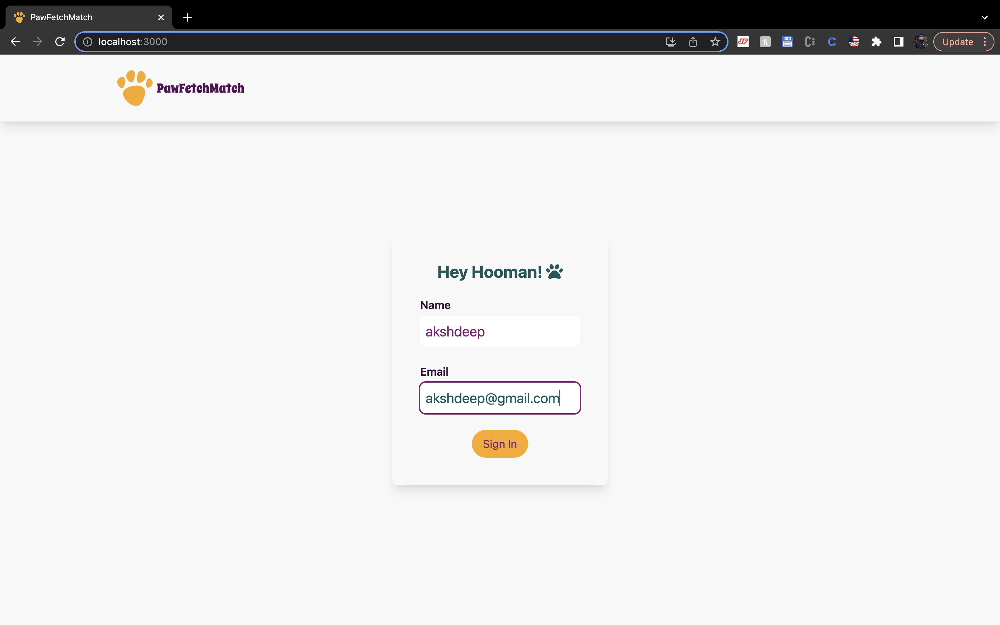
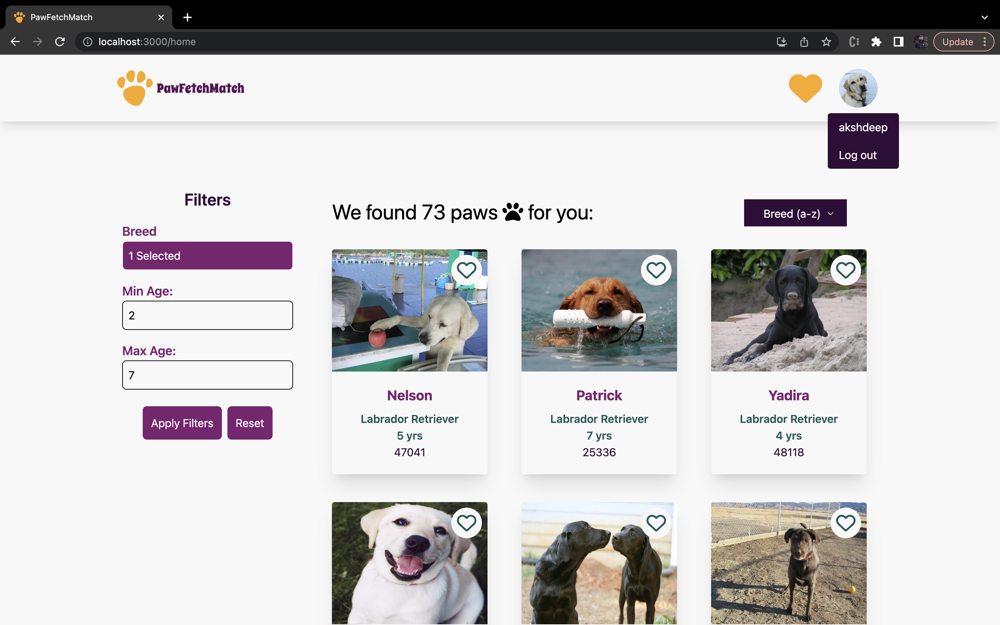
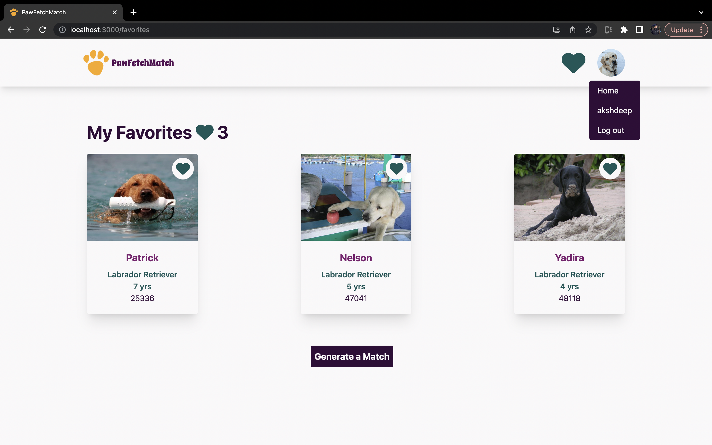

# PawfetchMatch

PawfetchMatch is a web app designed to help find dogs a new home. It provides a user-friendly interface for browsing and discovering dogs available for adoption. The app allows users to filter dogs based on various criteria such as breed, age, and more. Users can view detailed information about each dog and save their favorite dogs for future reference. Additionally, PawfetchMatch offers a unique "Generate a Match" feature that suggests dogs based on the user's preferences and existing favorites.

## Visit the Website

You can visit the live version of PawfetchMatch by clicking [here](https://akshdeep996.github.io/pawfetchMatch). Please make sure to use Chrome or Firefox browsers on your desktop to access the website.

## Getting Started

To run the app locally, follow these steps:

1. Clone the repository or download the source code.
2. Navigate to the project directory in your terminal. Make sure you are in the same place where package.json is located.
3. Run `npm install` to install the dependencies.
4. Run `npm start` to start the development server.
5. Open [http://localhost:3000](http://localhost:3000) in your web browser to view the app.

## Available Scripts

In the project directory, you can run the following scripts:

- `npm start`: Runs the app in development mode.
- `npm test`: Launches the test runner in interactive watch mode.

## Screenshots

Here are some screenshots of the PawfetchMatch app's login, home, and favorites pages:

### Login Page

The login page allows users to enter their name and email to sign in. Upon successful login, users are redirected to the home page.

### Home Page

The home page displays a list of dogs available for adoption. Users can apply various filters to narrow down the search results and view more details about each dog.

### Favorites Page

The favorites page shows the dogs that the user has saved as their favorites. Users can generate a match based on their favorite dogs and explore potential matches.

These screenshots provide a glimpse of the PawfetchMatch app's user interface and functionality.

Please make sure to visit the live website before getting started to experience PawfetchMatch in action.